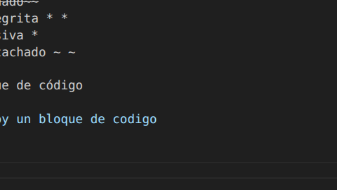

# 🍽️ RestorApp – Sistema de pedidos para restaurante

## 📌 Descripción del sistema

**RestorApp** es una aplicación web que simula un sistema de gestión de pedidos para un restaurante. El proyecto fue desarrollado como **simulacro de prueba de desempeño**, con el objetivo de evaluar habilidades en JavaScript, manipulación del DOM, manejo de estado, lógica de negocio y organización de un proyecto frontend.

La aplicación está inspirada en el siguiente diseño en Figma:
👉 [https://www.figma.com/design/HlbubAizLimCZGVRuqNtfT/Sin-t%C3%ADtulo](https://www.figma.com/design/HlbubAizLimCZGVRuqNtfT/Sin-t%C3%ADtulo)

El sistema permite la interacción de dos tipos de usuarios: **clientes** y **administradores**, cada uno con permisos y vistas específicas.

---

## 🚀 ¿Cómo ejecutar el proyecto?

1. Clona o descarga este repositorio.
2. Abre la carpeta del proyecto.
3. Ejecuta el archivo `index.html` en tu navegador web.

   * No se requiere servidor ni instalación adicional.
4. El sistema utiliza **LocalStorage / JSON** para la persistencia de datos.

---

## 👥 Roles del sistema

### 👤 Usuario (cliente)

Un usuario normal puede:

* Ver el menú del restaurante
* Agregar productos a un pedido
* Confirmar pedidos
* Ver **solo sus propios pedidos**
* Consultar su perfil

Estructura básica del usuario:

```js
{
  id,
  name,
  email,
  role // "user"
}
```

---

### 🛠️ Administrador

El administrador puede:

* Ver **todos los pedidos** del sistema
* Filtrar pedidos por estado
* Ver el detalle de cada pedido
* Cambiar el estado de los pedidos
* Gestionar el flujo de atención del restaurante

Estructura básica del usuario administrador:

```js
{
  id,
  name,
  email,
  role // "admin"
}
```

---

## 🧩 Módulos del sistema

### 📋 Menú del restaurante

* Lista dinámica de productos
* Cada producto incluye:

```js
{
  id,
  name,
  price,
  category
}
```

* Botón para agregar productos al pedido

---

### 🛒 Creación de pedidos

Un pedido contiene:

```js
{
  id,
  userId,
  items: [],
  total,
  status,
  createdAt
}
```

El usuario puede:

* Agregar productos
* Ver el resumen del pedido
* Confirmar el pedido

---

### 📦 Estados del pedido

Cada pedido maneja los siguientes estados:

* **Pendiente**
* **Preparando**
* **Listo**
* **Entregado**

Los estados:

* Se reflejan visualmente
* Son modificables desde el panel de administrador
* Se actualizan dinámicamente

---

### 👤 Perfil de usuario

La vista de perfil muestra:

* Nombre
* Correo electrónico
* Rol
* Cantidad de pedidos realizados
* Total gastado *(opcional avanzado)*

---

## 🔐 Sistema de vistas y rutas

La aplicación cuenta con las siguientes vistas:

* Vista de login *(opcional)*
* Vista de usuario
* Vista de administrador
* Vista de perfil

🔒 **Protección de rutas**:

* Un usuario no puede acceder al panel de administrador
* Un administrador no puede acceder al panel de usuario

---

## 💾 Persistencia de datos

La aplicación utiliza:

* **LocalStorage** y/o
* **Archivos JSON** simulando una base de datos

Se persiste la información de:

* Usuarios
* Menú
* Pedidos
* Sesión activa

---

## ⚙️ Requisitos técnicos implementados

El proyecto evidencia el uso de:

* Estado centralizado (arrays principales)
* Manipulación directa del DOM
* Eventos con `addEventListener`
* Formularios con `preventDefault`
* Métodos de arrays:

  * `map`
  * `filter`
  * `find`
  * `some`
  * `every`
* Renderizado dinámico de componentes
* Separación de archivos

---

## 📂 Estructura del proyecto

```text
/RestorApp
  ├── index.html
  ├── styles.css
  ├── app.js
  ├── data.json   // opcional
  └── README.md
```

---

## 🔄 Flujo de uso del sistema

1. El usuario inicia sesión (simulado).
2. Accede al menú y selecciona productos.
3. Confirma el pedido.
4. El pedido inicia en estado **Pendiente**.
5. El administrador gestiona y cambia el estado del pedido.
6. El usuario puede ver el estado actualizado en tiempo real.

---

## 🧠 Objetivo del proyecto

Este proyecto tiene como finalidad demostrar:

* Lógica de negocio en JavaScript
* Organización de un proyecto frontend
* Manejo de roles y estados
* Comunicación clara entre vistas y módulos

---

✨ *Proyecto desarrollado como simulacro de prueba de desempeño en desarrollo web.*

// información de coo hacer un readme

# Título principal (H1)
## Título secundario (H2)
### Título terciario (H3)
#### H4

**negrita**
*cursiva*
~~tachado~~
* * negrita * *
* cursiva *
 ~ ~ tachado ~ ~

 bloque de código 
```js
    soy un bloque de codigo

```
yo no


---
este es un sepradaor
---
esta es una lista
1. uno
2. dos
3. tres

---
guía rápida

# Nombre del Proyecto

Descripción corta del proyecto.

---

## 🚀 Cómo ejecutar
Pasos para usar el proyecto.

---

## 👥 Roles
- Usuario
- Administrador

---

## 🧩 Funcionalidades
- Ver menú
- Crear pedidos
- Gestionar estados

---

## 🗂️ Estructura
```text
/src

 
